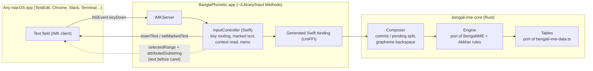

# macOS input source for bengali-ime — tech stack and design

Status: agreed design, not yet implemented. Decisions below came out of a design interview; the
"Defaults chosen" section lists the smaller calls made without asking, which are easy to change.

## Decisions

| Topic | Decision |
|---|---|
| Audience | Personal use. Built and installed locally, ad-hoc signed. No paid Apple Developer account, no notarization. |
| Engine | Port the algorithm to a **Rust core**, alongside the TypeScript library. TS stays the web engine and the reference ("oracle") until the Rust port is proven; shared fixtures enforce parity. |
| Platforms | macOS now. The binding layer must also serve an **iOS keyboard extension** later. |
| Typing UX | Exact Bengali on every keystroke. Only the engine's rewritable cluster (its `buffer`, usually 1–4 characters) is held as marked text, underline hidden where the app allows; everything else is committed immediately. |
| Backspace | Inside the pending cluster: delete one **grapheme cluster**. Nothing pending: pass the key to the app. |
| Bangla ↔ English | The macOS input source switch (Globe key / Ctrl+Space). The engine's English mode is not used. |
| Kar attach after caret moves | Read the text before the caret from the app when it allows (engine `textBeforeCaret`); otherwise fall back to the independent vowel. |
| Repo | This repository, as a monorepo. |
| v1 scope | Typing + input menu, menu toggles (digits, dari, smart quotes), `make install`/`make uninstall`, "Convert selection" (bulk roman→Bengali). |
| Target Mac | Apple Silicon (arm64), latest macOS. Deployment target macOS 14. |

## Tech stack

| Layer | Choice | Why |
|---|---|---|
| Engine core | **Rust** (stable, edition 2021), crate `bengali-ime-core`, no `unsafe`, no I/O | Single native engine for macOS and iOS (and later other platforms). Pure string state machine, same shape as the TS code. |
| Grapheme segmentation | `unicode-segmentation` crate | Replaces `Intl.Segmenter` used by `vowel-attach-context.ts`; also powers grapheme backspace. |
| FFI | **UniFFI** (proc-macro mode), crate `bengali-ime-ffi` | Generates an idiomatic Swift API (strings, structs, enums) with no hand-written C. The same generated binding works in an iOS keyboard extension. |
| Native packaging | Static lib for `aarch64-apple-darwin` packaged as an **XCFramework** (`scripts/build-xcframework.sh`) | Xcode links it like any framework; iOS slices (`aarch64-apple-ios`, `aarch64-apple-ios-sim`) are added to the same XCFramework later. |
| Input method | **Swift 6 + AppKit + InputMethodKit** (`IMKServer`, `IMKInputController`) | The only supported API for a third-party input source on macOS. No SwiftUI needed. |
| Xcode project | **XcodeGen** (`macos/project.yml`) | The project is a small reviewable YAML file instead of a merge-hostile `.pbxproj`. |
| Build / install | `Makefile` + `xcodebuild` + `codesign -s -` (ad-hoc) | `make install` builds everything, signs, copies to `~/Library/Input Methods`, and restarts the input method. |
| Settings | `UserDefaults` in the input method's own domain | Backs the menu toggles. |
| Logging | `os.Logger` (subsystem = bundle id) | Read with `log stream --predicate 'subsystem == "…"'`. |
| Parity tests | JSON fixtures generated by the TS engine, replayed by `cargo test`; plus seeded differential fuzzing | Keeps the two engines identical without hand-maintaining two test suites. |
| CI | Existing Node job + a Rust job on `ubuntu-latest`; a `macos-15` job that builds the XCFramework and the `.app` | Rust and fixtures run on Linux; only the Apple build needs a Mac runner. |

## Architecture



### Repository layout

```
bengali-ime/
├── src/                        # TS library (unchanged; stays the oracle)
├── fixtures/
│   ├── engine/*.json           # generated: key sequence → actions, output, buffer
│   └── composer/*.json         # hand-written: commit/pending/backspace cases (Rust-only behaviour)
├── scripts/
│   ├── gen-fixtures.ts         # runs the TS engine to (re)generate fixtures/engine
│   └── build-xcframework.sh
├── Cargo.toml                  # workspace
├── crates/
│   ├── bengali-ime-core/       # engine, data tables, composer, transpile
│   └── bengali-ime-ffi/        # #[uniffi::export] surface only
├── macos/
│   ├── project.yml             # XcodeGen
│   ├── BanglaPhonetic/         # main.swift, InputController.swift, ClientContext.swift, Menu.swift, Info.plist, icon
│   └── Makefile
└── docs/macos-input-source.md  # this file
```

## How the algorithm becomes a macOS input source

### 1. The commit / pending split

The TS engine returns edit actions (`insert`, `replace(charsBack)`, `delete(charsBack)`) that rewrite
text it already emitted: `k` then `h` replaces ক with খ. An input method cannot reliably rewrite
text it has already committed into another app, but it has full control over its **marked text**.

The engine's own state gives the split:

- `buffer` is always a suffix of `output` (checked by fuzzing 20,000 random 12-key sequences).
- Every rule rewrites only inside `buffer`: aspiration, `kkh` → ক্ষ, `rri` → ঋ/ৃ, `Oi`/`OU`, ya-phala,
  nasal connectors. **The single exception is `--` → `—`**, which replaces an already committed `-`.

So after every key:

```
committed = output[0 .. len(output) - len(buffer)]   → sent with insertText (final text in the app)
pending   = buffer                                   → sent with setMarkedText (still rewritable)
```

Example, typing `khub `:

| Key | Engine output / buffer | App shows | IMK calls |
|---|---|---|---|
| `k` | ক / ক | ক (pending) | `setMarkedText("ক")` |
| `h` | খ / খ | খ (pending) | `setMarkedText("খ")` |
| `u` | খু / "" | খু | `insertText("খু")` (replaces marked text) |
| `b` | খুব / ব | খুব (ব pending) | `setMarkedText("ব")` |
| space | খুব␣ / "" | খুব␣ | `insertText("ব ")` |

The `--` exception is handled in the composer: a lone `-` is held as pending, so a second `-` can
still turn it into `—` without touching committed text.

Marked text is set with attributes that remove the underline. Apps that honour the attributes show
the pending cluster exactly like normal text; the rest show a thin underline under 1–4 characters.

### 2. Rust core API (sketch)

```rust
// Faithful port: same behaviour as the TS BengaliIME, checked by fixtures.
pub struct Engine { /* buffer, output, flags */ }
impl Engine {
    pub fn new(config: Config) -> Self;
    pub fn process(&mut self, key: &str, text_before_caret: Option<&str>) -> Vec<Action>;
    pub fn process_backspace(&mut self) -> Vec<Action>;   // code-unit backspace, as in TS
    pub fn output(&self) -> &str;
    pub fn buffer(&self) -> &str;
}

// Host adapter for marked-text platforms (macOS, iOS). Exported through UniFFI.
pub struct Composer { /* Engine + committed length */ }
pub struct Update {
    pub commit: String,          // append to the document (replaces current marked text)
    pub pending: String,         // new marked text ("" = none)
    pub handled: bool,           // false → let the app process the key itself
}
impl Composer {
    pub fn key(&mut self, key: &str, text_before_caret: Option<String>) -> Update;
    pub fn backspace(&mut self) -> Update;   // one grapheme cluster of `pending`; handled=false if nothing pending
    pub fn flush(&mut self) -> Update;       // commit pending (focus loss, arrows, shortcuts)
    pub fn reset(&mut self);                 // caret moved / app changed: forget engine state
}
pub fn transpile_roman_document(input: &str, preserve_line_breaks: bool, config: Config) -> String;

pub struct Config { pub bengali_digits: bool, pub dari_for_period: bool, pub smart_quotes: bool }
```

`Config::default()` matches the TS engine exactly. Fixtures run with the default config. The toggles
are Rust-only additions.

All lengths crossing the FFI are counted in **UTF-16 code units** (what `NSString`/`NSRange` use and what
the TS `charsBack` means), even though Rust stores UTF-8.

### 3. Key routing in `InputController.handle(_:client:)`

| Event | Behaviour |
|---|---|
| Printable key, no ⌘/⌃/⌥ | `composer.key(event.characters, context)`, apply `Update`, return `true` |
| Space | Same as above (engine word boundary); pending is committed together with the space |
| Enter / Return | `flush()`, then return `false` so the app does its own newline or "send". The engine's `splitBlock` is not used. |
| Backspace | `composer.backspace()`; if `handled == false`, return `false` so the app deletes committed text its own way |
| Arrows, Tab, Esc, Home/End, Page keys | `flush()`, return `false` |
| Any ⌘ / ⌃ / ⌥ combination | `flush()`, return `false` (shortcuts keep working) |
| `deactivateServer`, `commitComposition` | `flush()` |
| Password / secure fields | macOS bypasses input methods automatically; nothing to do |

### 4. Reading `textBeforeCaret`

When `pending` is empty and a key could depend on the document (a vowel, which becomes a kar or an
independent vowel; `"` / `'` smart quotes; `-`), the controller reads:

```
range = client.selectedRange()
text  = client.attributedSubstring(from: NSRange(location: max(0, range.location - N), length: …))
```

`N` is bounded (the current paragraph, capped at ~1–2k UTF-16 units). The kar decision needs only the
last grapheme; smart quotes count opening vs closing quotes in the prior text, so they need the wider
window. If the client returns `nil` (Terminal, many Electron and Java apps), `text_before_caret` is
`None` and the engine falls back to its own `output`, the same as the TS engine does today.

**Caret-move detection:** before each key the controller compares `selectedRange()` with where it
expects the caret. On a mismatch (click, arrow keys handled by the app, paste) it calls `reset()`,
so the engine never builds a cluster on text that isn't there.

### 5. Menu (`InputController.menu()`)

- Bengali digits (on) — `1` → ১
- `.` types দাঁড়ি (on) — `.` → ।
- Smart quotes (on)
- Convert selection to Bengali — reads the selected text, runs `transpile_roman_document`, and
  replaces it with `insertText(_:replacementRange:)`. Works in apps that expose their text (Cocoa,
  most browsers); disabled or no-op elsewhere.

### 6. Bundle and install (personal use)

- Bundle id: `com.ahamed.inputmethod.BanglaPhonetic` (the id must contain `.inputmethod.`).
- `Info.plist`: `InputMethodConnectionName`, `InputMethodServerControllerClass`
  (`BanglaPhonetic.InputController`), `LSBackgroundOnly = YES`,
  `tsInputMethodCharacterRepertoireKey = [Beng]`, `tsInputMethodIconFileKey`, and a single input mode.
- `make install`: build the XCFramework → `xcodegen` → `xcodebuild` → `codesign --force -s -` →
  copy to `~/Library/Input Methods/` → `killall BanglaPhonetic` (macOS relaunches it on demand).
- First time only: System Settings → Keyboard → Text Input → Input Sources → Edit → **+** → Bengali
  → *Bangla Phonetic*. A log-out/log-in may be needed before it appears.
- Keep **ABC** enabled as a second input source: if the input method crashes during development,
  you can still type.

## Parity strategy (TS ↔ Rust)

1. `scripts/gen-fixtures.ts` runs the TS engine over (a) every input in the existing vitest suites,
   (b) a curated Bengali word list, and (c) seeded random key sequences. For each key it records the
   actions, `output` and `buffer`, and writes them to `fixtures/engine/*.json`.
2. `cargo test` replays every fixture through the Rust `Engine` and requires identical actions and
   state after every key.
3. CI regenerates the fixtures and fails if they differ from the committed ones, so a TS rule change
   without the matching Rust change can't merge (and vice versa).
4. Composer-only behaviour (commit/pending split, grapheme backspace, `-` holding, config toggles)
   has its own hand-written fixtures in `fixtures/composer/`.

**Known parity risk: grapheme boundaries.** `vowel-attach-context.ts` uses `Intl.Segmenter`, whose
rules depend on the ICU version bundled with Node or the browser. Unicode 15.1 added the Indic
conjunct rule (GB9c), which makes ক্ষ one grapheme cluster; older ICU splits it at the hasant.
`unicode-segmentation` follows whichever Unicode version the pinned crate implements. Pin the crate,
pin the Node version in CI, and keep conjunct cases in the fixtures so any difference shows up as a
test failure rather than a typing bug.

## Milestones

| # | Milestone | Where it can be built |
|---|---|---|
| M0 | Fixture generator + committed fixtures from the TS engine | Linux (this cloud session) |
| M1 | `bengali-ime-core` Engine port passing all engine fixtures | Linux |
| M2 | `Composer` + `Config` + grapheme backspace + `transpile_roman_document`, with composer fixtures | Linux |
| M3 | `bengali-ime-ffi` (UniFFI) + XCFramework script | Mac (Swift bindings can be generated on Linux; the Apple build needs a Mac) |
| M4 | IMK app MVP + `make install`: typing works in TextEdit | Mac |
| M5 | Context reading, caret-move reset, `--`, compatibility pass: TextEdit, Notes, Pages, Safari, Chrome, VS Code, Slack, Terminal, iTerm2, Spotlight, Word | Mac |
| M6 | Menu toggles + Convert selection | Mac |
| Later | iOS keyboard extension on the same XCFramework; optional live-commit mode for apps that support replacement ranges | Mac |

## Defaults chosen (not asked; easy to change)

- Input source name **Bangla Phonetic**, bundle id `com.ahamed.inputmethod.BanglaPhonetic`.
- Keys are read from `event.characters`, which assumes a US QWERTY base layout, the same as the web engine.
- Esc commits the pending cluster (it doesn't cancel it), because what you see is already the final text.
- UniFFI instead of a hand-written C ABI (cbindgen). Revisit if a Windows or Linux input method is
  ever added, since those need a C ABI.
